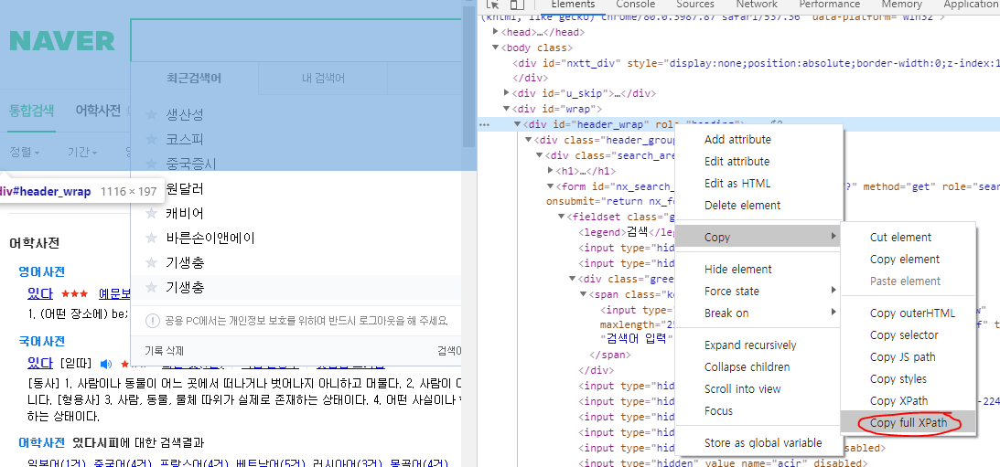
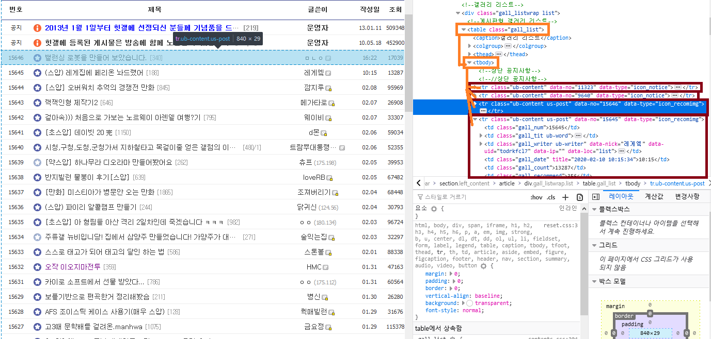
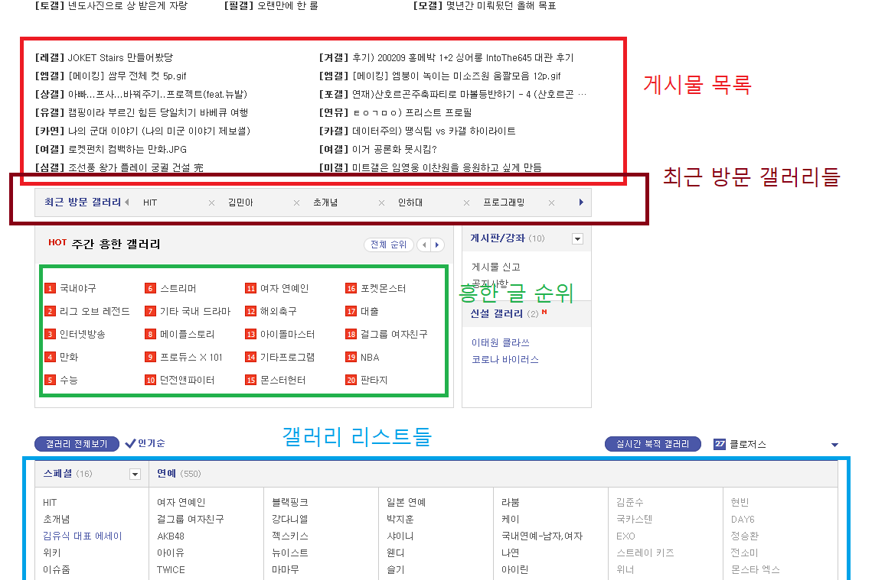
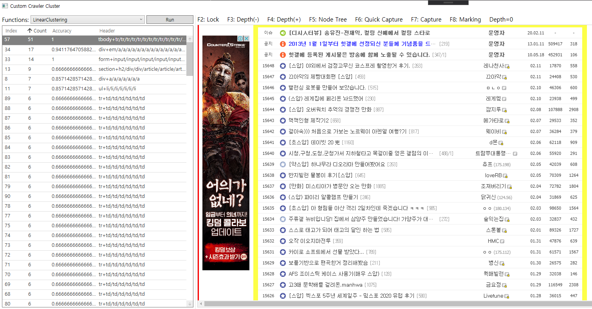
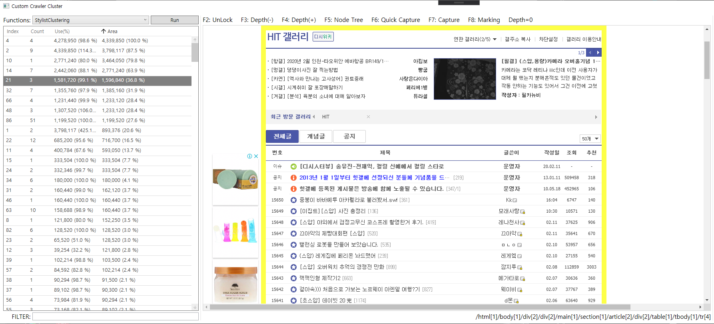
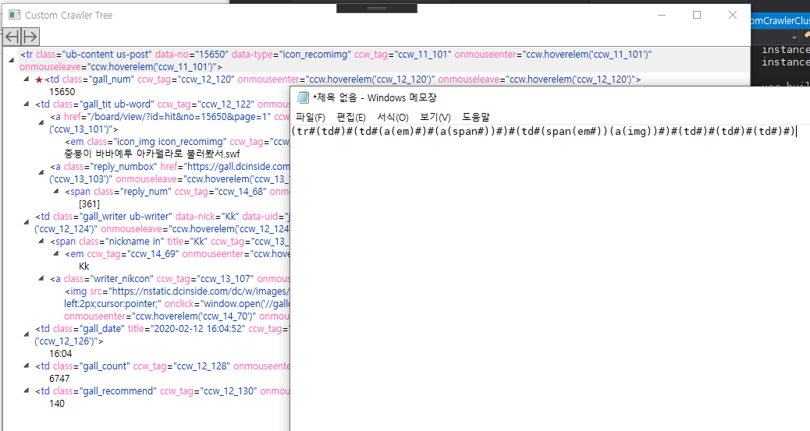
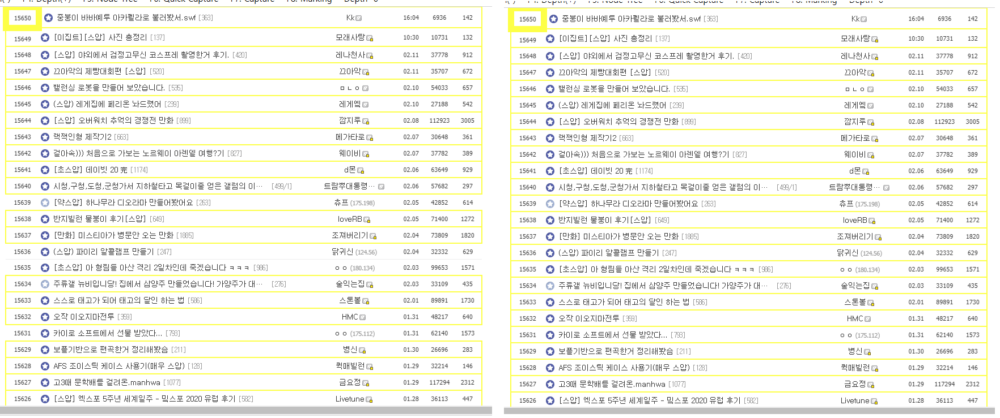
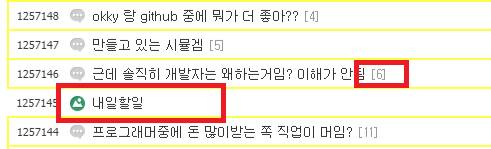
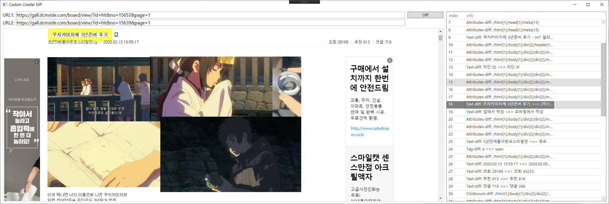
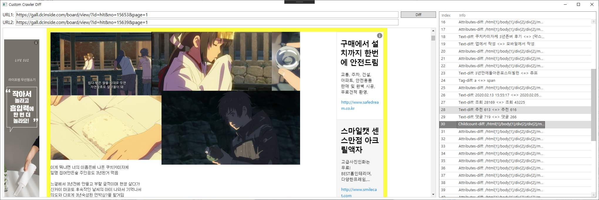

# 커스텀 크롤러 컨셉

`커스텀 크롤러`는 크롤링 및 정보 가공 과정을 자동화하거나, 프로그래머가 좀 더 쉽게
크롤러를 생성할 수 있도록 도와줄 수 있는 프로그램입니다.

이 내용은 커스텀 크롤러의 컨셉이며, 설계 중 언제든지 바뀔 수 있습니다.

## 0. HTML 분석 방법에 대해

`HTML`은 웹 브라우져의 요청으로 서버에서 다운로드되는 파일입니다.
이 파일에는 `.js`와 같은 메타파일 정보가 포함되며, 웹 브라우져는 메타파일을
모두 비동기로 다운로드하여 자바스크립트 엔진으로, 또는 기타 웹 브라우저에서 제공하는 기능들로 실행합니다.
웹 브라우져는 웹 페이지를 로딩할 때 크게 다음과 같은 과정을 거친다고 할 수 있습니다.

`HTML 다운로드` -> `HTML 분석` -> `META(.js, .css 등등) 데이터 요청` -> `렌더링 시작 및 Javascript, WASM, PHP 등 코드 실행`

### 0.1. HTML 분석 단계

`HTML 분석` 단계에서 웹 브라우져는 HTML을 파싱하고 교정하는 과정을 거칩니다.
교정과정은 HTML 파일이 HTML 문법에 맞지 않는 경우 이를 자동으로 수정해주는 과정입니다.
예를 들어 `<table>` 태그 하위에 `<tbody>`가 오지않고 바로 `<tr>` 태그가 나온다면 HTML 분석단계에서 `<tbody>`태그를 추가함으로써 HTML을 교정합니다.

따라서 웹 브라우져의 개발자도구에서 표시되는 HTML은 `URL`로 다운로드한 HTML과 상당히 다를 수 있습니다.

### 0.2. XPath?

`XPath`는 HTML의 특정 노드를 하나의 식으로 나타낸 것입니다.
이 식은 여러개의 노드를 가리킬 수 있고, 하나의 노드만 가리킬 수 있습니다.
크롤러를 만들 때 주로 `XPath`의 모든 스펙들을 두루 활용하지만,
HTML을 분석해주는 라이브러리들 덕분이 굳이 모든 스펙들을 사용하지 않고
특정 하나의 노드 위치를 알 수 있는 `XPath`를 쉽게 얻을 수 있습니다.

크롬 개발자 도구의 Inspector로 특정 Elements를 선택하고, 특정 HTML 노드에
마우스 오른쪽 클릭 후 `Copy -> Copy full XPath`를 누르면 특정 한 노드의 위치를 알 수
있는 `XPath`가 복사됩니다.



```
/html/body/div[3]/div[1]
/html[1]/body[1]/div[3]/div[1]
```

위와 같은 어떤 식이 복사되는데 이 식이 바로 `XPath`입니다.
두 식은 같은 표기이며, 아래식을 주로 사용할 겁니다.
HTML은 트리구조이며 트리의 하위 노드들에 순서가 있기 때문에 위와 같은 표기가 가능합니다.

위 식은 `<html>` 태그를 가진 첫 번째 하위 노드를 선택하고, 그 하위 노드의 첫 번째
`<body>` 노드를 선택하고, 이제 세 번째로 나오는 `<div>` 태그를 선택하고, 마지막으로
첫 번째로 나오는 `<div>`를 선택하라는 의미 입니다.

세 번째로 나오는 `<div>`태그는 `<body>`의 모든 하위 노드들 중에 `div` 태그를 가지는
모든 태그들을 순서대로 나열했을 때 세 번째 나오는 `div`를 선택하라는 의미입니다.

## 1. 크롤링 방법론

크롤링에는 크게 두 가지 방법이 있습니다.
정적 분석과 동적 분석입니다.
정적 분석은 `URL`을 통해 바로 다운로드받은 HTML파일을 바로 분석하는 방법이며,
동적 분석은 웹 브라우져가 메타데이터 및 자바스크립트 코드 등에 의해 비동기적으로 추가되는 웹 요소들을 분석하는 방법입니다.

## 2. 정적 분석

정적 분석은 `BeautifulSoup4`나 `HtmlAgilityPack`과 같은 HTML 파싱 도구를 사용하면 쉽게 구현할 수 있습니다.

### 2.1. HTML을 트리 노드로 나타내기

HTML은 기본적으로 `#document` 노드를 루트노드로하는 트리구조이며, 따라서 트리 자료구조로 쉽게 나타낼 수 있습니다.


대충 이렇게

정적 분석에선 HTML이 트리 구조인 것을 적극적으로 활용합니다.

### 2.2. 노드들의 공통 부분 찾기 - LCA

`<table>` 태그의 하위 노드들은 `<tr>`들로 구성되어있으며, `<tr>`들은 선형으로 나타납니다.

예를들어 다음과 같은 게시판을 분석해봅시다.



사진의 우측에서 볼 수 있다시피 `<table>`노드는 `<caption>`, `<tbody>` 등의 하위노드를 가지며
`<tbody>`는 `<tr>`들을 노드로 가집니다.
여기서 `<tr>`태그들이 선형적으로 나타남을 알 수 있습니다.
그러면 `XPath`로 다음과 같이 나타낼 수 있습니다.

```
.../table[1]/tbody[1]/tr[1]
.../table[1]/tbody[1]/tr[2]
.../table[1]/tbody[1]/tr[3]
...
```

여기서 `.../table[1]/tbody[1]` 부분은 모든 하위 노드에서 공통적으로 나타나는 부분입니다.
이 부분들을 제거하면 `<tr>` 노드들이 선형적으로 나열되어있는 부분이 보입니다.
이제 모든 `<tr>` 노드들을 방문하기 위해 다음과 같은 반복문을 작성할 수 있습니다.

```cpp
HtmlTree tree = HtmlTree.Parse(html)
string parent = '../table[1]/tbody[1]'

for ( int i = 0; ; i++ )
{
  string child_xpath = parent + '/tr[' + (i+1) + ']'
  Node child_node = tree.select_xpath(child)

  if (child_node == nullptr) break;

  // ...
}
```

간단하게 식 하나로도 표시할 수 있습니다.

```
.../table[1]/tbody[1]/tr[{i+1}]
```

위 코드를 이용해 자식 노드를 쉽게 방문할 수 있고, 모든 자식 노드들이 같은 형식을 가진다면
하나의 루틴으로 모든 자식을 쉽게 분석할 수 있습니다.

실제로 위 페이지(디시 힛갤 게시판 목록)을 `C#`으로 구현한 코드는 다음과 같습니다.

```csharp
public class Pattern
{
    public string Number;
    public string Icon;
    public string Title;
    public string Author;
    public string WriteTime;
    public string Views;
    public string UpVote;
}

public Pattern Extract(string html)
{
    HtmlDocument document = new HtmlDocument();
    document.LoadHtml(html);
    var result = new Pattern();
    var root_node = document.DocumentNode;
    for (int i = 1; ; i++)
    {
        var node = root_node.SelectSingleNode($"/html[1]/body[1]/div[2]/div[2]/main[1]/section[1]/article[2]/div[2]/table[1]/tbody[1]/tr[{3+i*1}]");
        if (node == null) break;
        result.Number = node.SelectSingleNode("./td[1]").InnerText;
        result.Icon = node.SelectSingleNode("./td[2]/a[1]/em[1]").InnerText;
        result.Title = node.SelectSingleNode("./td[2]/a[1]").InnerText;
        result.Author = node.SelectSingleNode("./td[3]").InnerText;
        result.WriteTime = node.SelectSingleNode("./td[4]").InnerText;
        result.Views = node.SelectSingleNode("./td[5]").InnerText;
        result.UpVote = node.SelectSingleNode("./td[6]").InnerText;

    }
}
```

이렇게 노드들의 공통 부분 (최소 공통 조상 - LCA)을 찾는 방법은
앞으로 크롤링 반자동화을 포함한 모든 부분에서 주로 사용됩니다.
위 코드는 반자동화 기능으로 자동으로 구현된 코드입니다.

### 2.3. 클러스터링

클러스터링은 비슷한 부분들을 묶는 것을 의미합니다.
웹 페이지에서 비슷한 부분들을 묶는 것을 예로 들어봅시다.



위와 같이 비슷한 부분들을 자동으로 찾아내고 정보들을 추출하는 것을 주 목적으로,
여러 클러스터링 방법들 만들어 시도했습니다.

#### 2.3.1. 선형 클러스터링

선형 클러스팅은 선형으로 나열된 요소들을 클러스터링하는 방법입니다.
`2.3`의 사진을 보면 게시물 목록, 이나 최근 방문 갤러디들,
흥한 글 순위, 갤러리 리스트들이 순서대로 나열되어있는 걸 볼 수 있습니다.
이런 리스트들이 선형 클러스터링의 대상이 됩니다.
이 방법을 통해 대부분의 웹 요소들을 분석할 수 있다고 기대합니다.

선형 클러스터링의 기본적인 아이디어는 어떤 특정노드의 하위노드들의 유사도를 비교하는 것입니다.
하위 노드들이 많고 정확도가 높다면 선형으로 나열된 부분이 검색되었을 확률이 매우 높습니다.
다음 예제는 선형 클러스터링을 통해 선형적 요소를 찾은 결과입니다.



위 사진에서 좌측은 선형 클러스트링의 결과이고, 우측은 가장 많은 요소들과 정확도가 높은
결과를 하나 선택한 결과를 굵은 노란색 박스로 나타낸 결과입니다.
`Accuracy`가 1로 모든 하위노드들이 같은 형태를 가지고 있으며, 이런 하위노드들이 51개나있는
모습을 볼 수 있습니다.

다음은 이 기능을 구현한 코드입니다.

```csharp
public List<(int, double, HtmlNode, List<HtmlNode>)> LinearClustering(int min_child_count = 2, double min_diff_rate = 0.6)
{
    var result = new List<(int, double, HtmlNode, List<HtmlNode>)>();
    // 모든 노드들 순회
    // foreach 이중루프는 모든 노드를 순회함.
    foreach (var nn in depth_map)
        foreach (var node in nn)
        {
            if (node.ChildNodes.Count >= min_child_count)
            {
                var ff = filtering_child_node(node);
                var h2 = get_child_node_hashs_2nd(ff);

                if (h2.Count == 0)
                    continue;

                var diff = estimate_diff_node_hashs(h2);

                if (diff >= min_diff_rate)
                    result.Add((ff.Count, diff, node, ff));
            }
        }

    return result;
}

private string get_child_node_hash(HtmlNode node)
{
    return node.Name + "/" + string.Join("/", node.ChildNodes.Select(x => x.Name));
}

// 쓸모없는 하위 노드들을 삭제함
private List<HtmlNode> filtering_child_node(HtmlNode node)
{
    var childs = node.ChildNodes.ToList();
    // 주석이나 스크립트 텍스트같이 HTML 구조에 큰 구조에
    // 큰 영향을 미치는 노드가 아니면 모두 비교 대상에서 삭제함
    childs.RemoveAll(x => x.Name == "#comment";
    childs.RemoveAll(x => x.Name == "script");
    childs.RemoveAll(x => x.Name == "#text");
    childs.RemoveAll(x => x.Name == "meta");
    childs.RemoveAll(x => x.Name == "link");
    childs.RemoveAll(x => x.Name == "title");
    childs.RemoveAll(x => x.Name == "head");
    childs.RemoveAll(x => x.Name == "style");
    if (node.Name == "tbody" || node.Name == "table")
        return childs.Where(x => x.Name == "tr").ToList();
    return childs;
}

private List<string> get_child_node_hashs_2nd(List<HtmlNode> child_nodes)
{
    return child_nodes.Select(x => get_child_node_hash(x)).ToList();
}

// hashs의 요소 중 가장 많은 공통 노드들의 개수를 hashs의 요소 개수로 나눈값
private double estimate_diff_node_hashs(List<string> hashs)
{
    var hash = new Dictionary<string, int>();

    hashs.ForEach(x =>
    {
        if (!hash.ContainsKey(x))
            hash.Add(x, 0);
        hash[x] += 1;
    });

    return hash.Select(x => x.Value).Max() / (double)hashs.Count;
}
```

#### 2.3.2. 스타일 클러스터링 (가시성 기반 분석)



웹 디자이너(프론트엔드 개발자)는 이용자들을 위한 UI/UX를 설계를 했을 가능성이 매우 높습니다.
접근하기 쉬운 부분(맨 처음에 보이는 부분)엔 가장 중요한 정보와 앞으로 설명할
내용들을 요약해 표시되어있을 확률이 매우 높으며 페이지 하단에는 웹 페이지의
의도를 정확하게 전달하기 위한 정보들을 제공했을 가능성이 높습니다.
웹 페이지에서 가장 많은 부분을 차지하는 부분이 가장 핵심이 되는 부분이며,
따라서 이 부분이 가장 중요한 부분일 가능성이 제일 높습니다.

스타일 정보를 얻어오는 것은 웹 브라우져의 도움이 필요합니다.
웹 브라우져에서 어떤 원소가 어느 정도의 크기를 가지는 지에 대한 정보를 모두 가져오고,
이제 어떤 노드가 차지하는 영역의 넓이를, 그 노드의 하위 노드들이 차지하는 영역의 넓이를
합친 값으로 나눈 값의 역수를 구하여 어떤 영역의 전용면적을 구합니다.

전용면적이 상위 노드의 넓이와 비슷하면서 페이지에서 차지하는 넓이가 가장 넓거나,
하위 노드의 개수가 많을 수록 사용자에게 중요하다고 인식될 가능성이 높습니다.

### 2.4. 패턴 분석

패턴 분석 방법은 어떤 노드와 그 하위 노드들이 모두 포함된 상태의 구조가 페이지의 다른 곳에서
나타나는지, 또한 어느정도의 유사도를 가지면서 나타나는지를 분석하는 방법입니다.
패턴 분석을 통해 요소 태깅 생산성을 극대화시킬 수 있습니다.

#### 2.4.1. 선형 패턴 비교

HTML 노드를 선형화 시키기 위한 방법으로 여러방법이 있겠지만,
이번 패턴 분석 방법에선 후위탐색을 이용해 유일한 패턴 문자열을 생성합니다.
`make_string` 함수는 특정 노드를 선형화합니다.

```cs
// for DP
Dictionary<HtmlNode, string> msdp = new Dictionary<HtmlNode, string>();
private string make_string(HtmlNode node)
{
    if (node.ChildNodes.Count == 0)
    {
        if (node.Name == "#text")
            return "#";
        return $"({node.Name})";
    }
    if (msdp.ContainsKey(node))
        return msdp[node];
    var ms = $"({node.Name}{string.Join("", node.ChildNodes.ToList().Where(x => x.Name != "#comment").Select(x => make_string(x)))})";
    msdp.Add(node, ms);
    return ms;
}
```



위는 왼쪽의 노트 트리가 우측의 패턴 문자열로 변환되는 예제입니다.
`#`은 문자열(`#text`)을 가리킵니다.

두 패턴 문자열이 어느 정도의 유사도를 가지는 지를 계산하기 위해,
두 개의 문자열의 자카드 유사도를 구합니다.
레벤슈타인 알고리즘을 통해 두 문자열의 선형적인 차이를 계산할 수 있으며,
이 차이를 긴 문자열의 길이로 나눔으로써 유사도를 구할 수 있습니다.

```cs
public static int ComputeLevenshteinDistance(this string a, string b)
{
    int x = a.Length;
    int y = b.Length;
    int i, j;

    if (x == 0) return x;
    if (y == 0) return y;
    int[] v0 = new int[(y + 1) << 1];

    for (i = 0; i < y + 1; i++) v0[i] = i;
    for (i = 0; i < x; i++)
    {
        v0[y + 1] = i + 1;
        for (j = 0; j < y; j++)
            v0[y + j + 2] = Math.Min(Math.Min(v0[y + j + 1], v0[j + 1]) + 1, v0[j] + ((a[i] == b[j]) ? 0 : 1));
        for (j = 0; j < y + 1; j++) v0[j] = v0[y + j + 1];
    }
    return v0[y + y + 1];
}
```

다음은 패턴 비교 예제입니다.

```
비교 대상 패턴: (tr#(td#)#(td#(a(em)#)#(a(span#))#)#(td#(span(em#))(a(img))#)#(td#)#(td#)#(td#)#)

정확도    패턴 내용
( 64.2%) (tr#(td#)#(td(a(em)(b#)))#(td(b#))#(td#)#(td#)#(td#)#)
( 75.3%) (tr#(td#)#(td#(a(em)(b(b#)))#(a(span#))#)#(td#(b(b#))#)#(td#)#(td#)#(td#)#)
( 71.6%) (tr#(td#)#(td#(a(em)(b(b(font#))))#(a(span#))#)#(td#(b(b#))#)#(td#)#(td#)#(td#)#)
( 92.6%) (tr#(td#)#(td#(a(em)#)#(a(span#))#)#(td#(span(em#))(span#)#)#(td#)#(td#)#(td#)#)
(100.0%) (tr#(td#)#(td#(a(em)#)#(a(span#))#)#(td#(span(em#))(a(img))#)#(td#)#(td#)#(td#)#)
```

#### 2.4.2. 패턴 매칭

앞서 어떤 노드를 선형으로 나타내어 다른 노드와의 유사도를 비교하는 예제를 설명했습니다.
패턴 매칭 과정은 HTML 최상위 노드의 모든 부분 집합을 탐색해 유사한 노드들을 찾습니다.
이때 사용자 정의에 따라 정확도를 설정하여 비슷한 패턴들도 찾을 수 있습니다.



왼쪽은 어떤 패턴과 100% 유사도를 갖는 경우를 탐색한 결과이고, 오른쪽은 80% 이상의 유사도를 갖는 경우를 탐색한 결과입니다.

만약 패턴들의 LCA가 패턴들을 하위노드로 갖는다면 반복문을 통한 접근이 가능해집니다.
`2.2 절` 하단의 코드를 참고해보세요. 이와 같은 코드를 쉽게 생성해 낼 수 있습니다.

#### 2.4.3. 크롤링 코드 생성

100%의 정확도로 패턴을 찾은 경우라면 모든 과정을 모든 노드에 완벽하게 적용시킬 수 있지만,
유사도가 다른 것들이 섞여있다면 이를 분류하는 과정이 필요합니다.



위와 같이 댓글이 하나 이상 달린 글에는 댓글의 개수가 제목에 표시되어있지만, 댓글이 없는 경우엔 표시되지 않았습니다.
따라서 모든 노드에 대해 댓글의 개수를 가져오는 부분을 넣는다면 오류가 생길 수 있습니다.
코드를 생성하기전 전수조사를 통해 이러한 어긋난 패턴들을 분석하는 과정이 필요하며,
코드 생성시 이를 참고해 적절한 코드를 생성할 수 있어야 합니다.

다음은 패턴 분석 정보의 일부입니다.

```
-- Captures Info remove LCA Prefix --
@Number = /td[1]
@Icon = /td[2]/a[1]/em[1]
@Title = /td[2]/a[1]
@Comment = /td[2]/a[2]/span[1]
@Author = /td[3]
@WriteTime = /td[4]
@Views = /td[5]
@UpVote = /td[6]

-- Captures Info Origin --
@Number = /html[1]/body[1]/div[2]/div[2]/main[1]/section[1]/article[2]/div[2]/table[1]/tbody[1]/tr[4]/td[1]
@Icon = /html[1]/body[1]/div[2]/div[2]/main[1]/section[1]/article[2]/div[2]/table[1]/tbody[1]/tr[4]/td[2]/a[1]/em[1]
@Title = /html[1]/body[1]/div[2]/div[2]/main[1]/section[1]/article[2]/div[2]/table[1]/tbody[1]/tr[4]/td[2]/a[1]
@Comment = /html[1]/body[1]/div[2]/div[2]/main[1]/section[1]/article[2]/div[2]/table[1]/tbody[1]/tr[4]/td[2]/a[2]/span[1]
@Author = /html[1]/body[1]/div[2]/div[2]/main[1]/section[1]/article[2]/div[2]/table[1]/tbody[1]/tr[4]/td[3]
@WriteTime = /html[1]/body[1]/div[2]/div[2]/main[1]/section[1]/article[2]/div[2]/table[1]/tbody[1]/tr[4]/td[4]
@Views = /html[1]/body[1]/div[2]/div[2]/main[1]/section[1]/article[2]/div[2]/table[1]/tbody[1]/tr[4]/td[5]
@UpVote = /html[1]/body[1]/div[2]/div[2]/main[1]/section[1]/article[2]/div[2]/table[1]/tbody[1]/tr[4]/td[6]

-- Available Captures Info --
@Number = /html[1]/body[1]/div[2]/div[2]/main[1]/section[1]/article[2]/div[2]/table[1]/tbody[1]/tr[4]/td[1]
@Icon = /html[1]/body[1]/div[2]/div[2]/main[1]/section[1]/article[2]/div[2]/table[1]/tbody[1]/tr[4]/td[2]/a[1]/em[1]
@Title = /html[1]/body[1]/div[2]/div[2]/main[1]/section[1]/article[2]/div[2]/table[1]/tbody[1]/tr[4]/td[2]/a[1]
@Author = /html[1]/body[1]/div[2]/div[2]/main[1]/section[1]/article[2]/div[2]/table[1]/tbody[1]/tr[4]/td[3]
@WriteTime = /html[1]/body[1]/div[2]/div[2]/main[1]/section[1]/article[2]/div[2]/table[1]/tbody[1]/tr[4]/td[4]
@Views = /html[1]/body[1]/div[2]/div[2]/main[1]/section[1]/article[2]/div[2]/table[1]/tbody[1]/tr[4]/td[5]
@UpVote = /html[1]/body[1]/div[2]/div[2]/main[1]/section[1]/article[2]/div[2]/table[1]/tbody[1]/tr[4]/td[6]

-- Pattern Info --
P-Summary: (tr#@Number#(td#@Title#(a@Comment)#)#@Author#@WriteTime#@Views#@UpVote#)
P-LCA: /html[1]/body[1]/div[2]/div[2]/main[1]/section[1]/article[2]/div[2]/table[1]/tbody[1]/tr[4]
LCA: /html[1]/body[1]/div[2]/div[2]/main[1]/section[1]/article[2]/div[2]/table[1]/tbody[1]

-- Capture result from Page --
Count: 40
...
-------------------------
test-case: #21
tc-lca: /html[1]/body[1]/div[2]/div[2]/main[1]/section[1]/article[2]/div[2]/table[1]/tbody[1]/tr[24]
@Number = 1257146
@Icon = /em:{class="icon_img icon_txt"}
@Title = 근데 솔직히 개발자는 왜하는거임? 이해가 안됨
@Comment = [6]
@Author = ㅇㅇ(106.101)
@WriteTime = 02.12
@Views = 48
@UpVote = 0
...
```

`Available Captures Info`를 보면 `@Comment`가 빠져있는 것을 볼 수 있습니다.
이는 코드생성시 `@Comment`를 핸들링할 수 있는 적절한 코드를 삽입하라는 의미로 볼 수 있습니다.
이제 위 정보를 이용해 다음 코드를 얻을 수 있습니다.

```cs
public class Pattern
{
    public string Number;
    public string Icon;
    public string Title;
    public string Comment;
    public string Author;
    public string WriteTime;
    public string Views;
    public string UpVote;
}

public List<Pattern> Extract(string html)
{
    HtmlDocument document = new HtmlDocument();
    document.LoadHtml(html);
    var root_node = document.DocumentNode;
    var result = List<Pattern>();
    for (int i = 1; ; i++)
    {
        var node = root_node.SelectSingleNode($"/html[1]/body[1]/div[2]/div[2]/main[1]/section[1]/article[2]/div[2]/table[1]/tbody[1]/tr[{3+i*1}]");
        var pattern = new Pattern();
        if (node == null) break;
        pattern.Number = node.SelectSingleNode("./td[1]").InnerText;
        pattern.Icon = node.SelectSingleNode("./td[2]/a[1]/em[1]").InnerText;
        pattern.Title = node.SelectSingleNode("./td[2]/a[1]").InnerText;
        if (node.SelectSingleNode("./td[2]/a[2]/span[1]") != null)
            pattern.Comment = node.SelectSingleNode("./td[2]/a[2]/span[1]").InnerText;
        pattern.Author = node.SelectSingleNode("./td[3]").InnerText;
        pattern.WriteTime = node.SelectSingleNode("./td[4]").InnerText;
        pattern.Views = node.SelectSingleNode("./td[5]").InnerText;
        pattern.UpVote = node.SelectSingleNode("./td[6]").InnerText;
        result.Add(pattern);
    }
    return result;
}
```

### 2.5 차이점 분석

차이점 분석은 두 `HTML`의 차이점을 분석하는 방법입니다.
이 기능이 필요한 경우의 예로는 두 게시물의 차이점을 분석해 제목, 글쓴이, 본문 등의 정보를
자동으로 찾아내는 경우 등이 있습니다. 차이점 분석은 여러 다른 정적 분석 방법들이랑 같이 사용할 때
생산성을 더욱 높힐 수 있을 것으로 기대합니다.

차이점 분석의 기본적인 아이디어는 매우 단순하게 모든 노드를 순서대로 똑같이 방문하여 다른 부분을 모두
찾아는 것입니다. 만약 태그가 다르거나, 자식 노드의 개수가 다르다면 더이상 방문하지 않습니다.
이와 같이 두 루트 노드를 동시에 방문하게 되면 다음과 같은 네 가지 경우의 차이점이 발생합니다.

```
1. 태그가 다른 경우
2. 속성이 다른 경우
3. 자식 노드의 개수가 다른 경우
4. 포함된 텍스트가 다른 경우
```

태그가 다른 경우라면 하위 노드들도 모두 바뀌었을 가능성이 있으며, 이는 웹 페이지를 불러 올 때마다,
혹은 다른 `URL Parameter`로 웹 페이지를 로딩할 때마다 다른 노드구조를 갖는 다는 의미로 볼 수 있으므로,
따라서 이 부분이 제목이나 본문같은 핵심이 될 부분이 될 가능성이 높다는 것을 의미합니다.
다만, 태그가 다른 경우가 발생하는 경우는 매우 매우 드물다고 할 수 있습니다.

속성이 다른 경우라면 다른 웹 리소스를 불러오는 경우가 대부분이므로(예를 들어 `` 태그의 `src` 속성)
이는 웹 페이지를 불러올 때마다 달라질 가능성이 높다는 것을 의미합니다.

자식 노드의 개수가 다른 경우는 비슷한 유형의 두 웹페이지를 분석하는 경우엔 거의 나타나지 않는 차이점입니다.
여기서 거의라는 것은 많아야 두 개 정도이고, 보통 0개나 1개임을 의미합니다.
이 부분이 본문일 가능성이 가장 높은 부분입니다. 따라서 본문을 찾고 싶다면 자식 노드의 개수가 다른 경우를
먼저 살펴보는게 가장 좋은 방법이라고 할 수 있습니다.

포함된 텍스트가 다른 경우는 웹 페이지마다 동일한 구조(스타일)로 UI가 제공되지만 그 안의 컨텐츠가 다르다는 의미입니다.
따라서 제목이나 글쓴이와 같은 컨텐츠들을 탐색하고자 할 때 이 부분을 먼저 살펴보는게 좋습니다.



위 사진은 포함된 텍스트가 다른 경우의 예제입니다.

아래 사진은 자식 노드의 개수가 다른 겨우의 예제입니다.



## 3. 동적 분석

동적 분석에 관한 내용은 다음을 참고해주세요

https://blog.naver.com/rollrat/221905945071

https://blog.naver.com/rollrat/221906735915

https://blog.naver.com/rollrat/221908229380

https://github.com/rollrat/custom-crawler/blob/master/Documents/Dynamics.md
