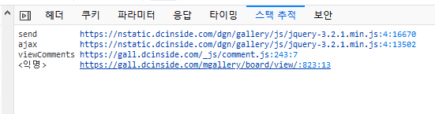
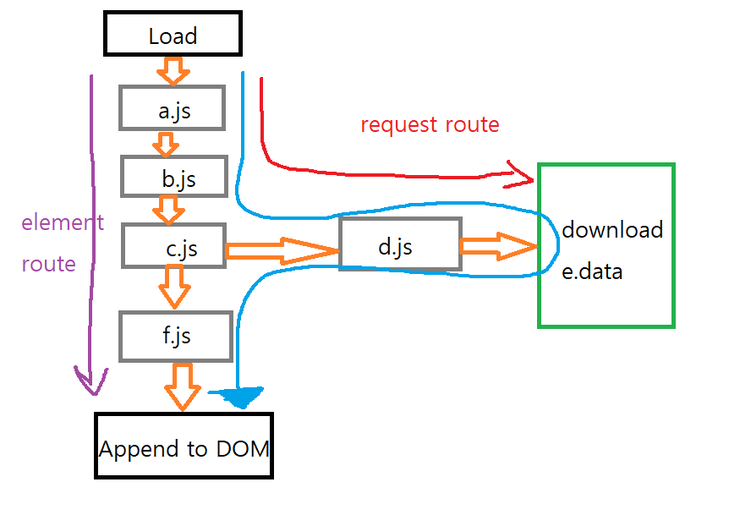

# Custom Crawler Dynamics

I use cef.browser to connect chrome dev tools protocol.

https://chromedevtools.github.io/

## Dynamic DOM Analysis

First, get backend node id using node id

https://chromedevtools.github.io/devtools-protocol/tot/DOM/#method-pushNodesByBackendIdsToFrontend

https://github.com/rollrat/custom-crawler/blob/47e1dc0b87f905651282f1e1b22f9cd2a44c31f1/CustomCrawler/CustomCrawlerDynamicsHover.xaml.cs#L67

Second, get node stack traces information

https://chromedevtools.github.io/devtools-protocol/tot/DOM/#method-getNodeStackTraces

https://github.com/rollrat/custom-crawler/blob/47e1dc0b87f905651282f1e1b22f9cd2a44c31f1/CustomCrawler/CustomCrawlerDynamicsHover.xaml.cs#L68

## Find Download(Requested) Data Associated With Dynamic Added Elements



Data from the Network tab of the developer tool (.Files such as js, json, html) can be seen from which code the request was made. Since stack tracking is a functional unit, it is different from the elemet creation route implemented in the previous post. Therefore, if you mix the two well, you will achieve your goal.



The request route and element create route must be different. This is because the download request function cannot do two things at the same time, such as adding nodes. How can we know if e.data influenced element generation when looking at the picture above?

`Load(requested by HTML script)->a.js->b.js->c.js` is the same until. The element calls `f.js`, and the request calls `d.js`. If so, we can now see that there is a branch in `c.js`.

In `c.js`, a function receives data through `d.js` and then called `f.js`. Assuming that `e.data` unconditionally affects element creation, `d.js` is called and then `f.js` is called. Now you can check if you called `d.js` during element creation. That is, it is possible to see whether `d.js` is called in the element creation route.

Static analysis is essential to accurately proceed with this process, and there is a way to verify it with a high probability without having to perform static analysis. The method is as follows.

1. Calculate the parse tree path of the part of `c.js` to call `f.js`.
2. Calculate the parse tree path of the part of `c.js` to call `d.js`.
3. Compare the two paths to check whether a prior common token in `function`, `call`, and `block` occurs and how long it is.
4. If the length is 0, the two operations are not related to each other with a high probability.
5. If the length is more than 1, it can be considered to be related with a high probability.

There is only one exception in number 4 of the above method, when the js file calls the code immediately without any function declaration. In this case, it is the same from the load stage, so you can check whether it is related or not. In addition, this is rarely the case, but in some cases, elemet creation is performed with data loaded in advance, which cannot be confirmed unless it is static analysis.

Pre-processing is essential to make this work easier. Save all downloaded `.js` data and create pastries. In addition, the call path of all downloaded data should be marked on each `.js`. Now, when a request is made to find data associated with a particular element, the results can be obtained in the following way. I took the picture above as an example.

1. Start in reverse order of element creation.
2. List all the files downloaded from `f.js`.
3. First, compare whether it is called in the same function, and compare the line/number.
   - If matched, it matches perfectly matches. This file affects element creation.
   - If it does not match, check it by comparing pastries.

Note) If you only know which `.js` file is and the line column number, you can obtain the parse tree path as follows. There are a lot of js dug up, so you can use anything.

```csharp
void find_internal(ref List<INode> result, IEnumerable<INode> node, int line, int column)
{
    if (node == null || node.Count() == 0)
        return;

    var nrr = node.ToList();
    var ii = nrr.BinarySearch(new bb(line, column), Comparer<INode>.Create((x, y) =>
    {
        if (x.Location.Start.Line != y.Location.Start.Line)
            return x.Location.Start.Line.CompareTo(y.Location.Start.Line);
        if (x.Location.Start.Column != y.Location.Start.Column)
            return x.Location.Start.Column.CompareTo(y.Location.Start.Column);
        return 0;
    }));

    if (node.Count() == 1)
        ii = 0;

    if (ii < 0)
        ii = ~ii - 1;

    if (ii < 0 || ii >= node.Count())
        return;

    var z = node.ElementAt(ii);

    if (z.Location.Start.Line > line || z.Location.End.Line < line)
        return;

    if (z.Location.Start.Line == z.Location.End.Line)
    {
        if (z.Location.Start.Column > column || z.Location.End.Column < column)
            return;
    }

    result.Add(z);

    find_internal(ref result, z.ChildNodes, line, column);
}
```

This below method `pick_candidate` is function that compare two parse tree.

https://github.com/rollrat/custom-crawler/blob/47e1dc0b87f905651282f1e1b22f9cd2a44c31f1/CustomCrawler/CustomCrawlerDynamics.xaml.cs#L470
