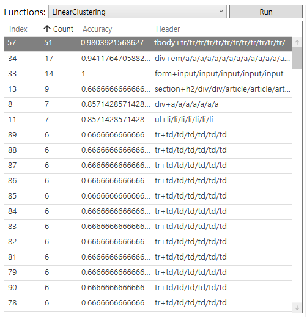
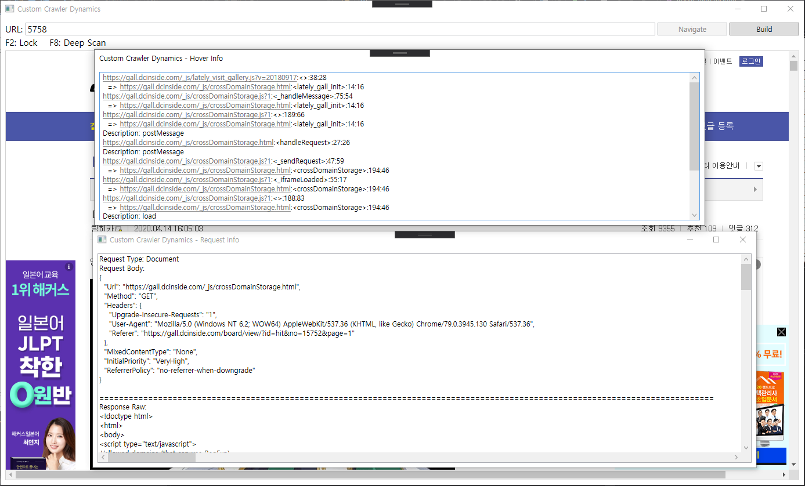

# Custom Crawler - Easiest Way To Create a Crawler

`Custom Crawler` is a tool for automatic crawler generation.
This project is based on `WPF` and requires `.NET Framework 4.7.2` or higher.
This program only runs on `Windows 10`.

한국어 설명(Korean Description): https://github.com/rollrat/custom-crawler/blob/master/CONCEPT.md

## Menu

 - [Download](#download)
 - [Documents](#documents)
 - [0. Before Introducing This Tool...](#0-before-introducing-this-tool)
 - [1. Static Web Analysis](#1-static-web-analysis)
   - [1.1. Tag Information Extraction](#11-tag-information-extraction)
   - [1.2. Clustering Tool](#12-clustering-tool)
     - [1.2.1. Linear Clustering](#121-linear-clustering)
     - [1.2.2. Stylist Clustering](#122-stylist-clustering)
     - [1.2.3. Formatted Pattern Extraction](#123-formatted-pattern-extraction)
   - [1.3. Diff Tool](#13-diff-tool)
 - [2. Dynamic Web Analysis](#2dynamic-web-analysis)
   - [2.1. Dynamic DOM Analysis](#21-dynamic-dom-analysis)
   - [2.2. Find Download(Requested) Data Associated With Dynamic Added Elements](#22-find-downloadrequested-data-associated-with-dynamic-added-elements)
   - [2.3. Deep Scan](#23-deep-scan)
 - [3. JavaScript Static Analysis](#3-javascript-static-analysis)
 - [4. Crawler Generator](#4-crawler-generator)
 - [Libraries](#libraries)

## Download

Latest Version: https://github.com/rollrat/custom-crawler/releases/download/2020.04.14/custom-crawler-2020.04.14.zip

## Documents

[About JavaScript Static Analysis](Documents/JavaScriptAnalysis.md)

## 0. Before Introducing This Tool...

1. You should know what `HTML` and `JavaScript` are.

2. To use static analysis tools, you need to know what the `xpath` is. It is not necessary for dynamic analysis.

3. If you have any issues please let me know or pull request!

### 0.1. What is different from a web automation tool like Selenium IDE?

`Selenium` is very easy and powerful, but its performance is a bit slow because it follows all user actions.
Therefore, most crawls are produced by directly analyzing HTML and Javascript.
Writing a crawler takes a lot of time, so I created this tool to cut it down a bit.

## 1. Static Web Analysis

Static web page analysis refers to the analysis of .html files alone.
Most of them are defined in the html file, except for some of the elements displayed in the browser.
So if you can fully analyze html, you can get a lot of information.

The static analysis tool for this project is a tool that deals with `xpath`.
We have implemented how to easily extract and pattern the `xpath`.

## 1.1. Tag Information Extraction

When you run the program for the first time, you may encounter the following screen.


Under the Load button on the right, select all the tags you want to display, enter the URL, and press the Load button.
Then, you can see a list like this


The order of this list is the depth order of the html nodes.
There are many reasons for showing nodes in depth order, but one of them is because it is easy to analyze patterns..
Look at the next picture and try it!


This is a tool that finds least common ancestors of selected nodes and then patterns them.

Also, if you press Tree or LCA Tree in the right button, you can see the following screen.


This feature displays nodes in a tree format similar to the inspector in the web browser developer tools.

These two features alone will greatly help you build a crawler.
In particular, this feature is convenient when analyzing something that is linearly listed, such as a bulletin board.

## 1.2. Clustering Tool

Name and function are not very relevant.

After loading a URL, you can run the Clustering Tool by clicking Cluster in the SubTools group at the bottom right.


As you can see in the picture above, hovering over a specific point shows the xpath and `C# Code`.
Also, you can do many things through the shortcuts displayed at the top.

Try that yourself.

### 1.2.1. Linear Clustering

Linear Clustering is a tool that analyzes what patterns the child nodes have.



With this feature, you can easily find something complicated, that is, where the web designer thought it was important.

### 1.2.2. Stylist Clustering


This tool is helpful when you want to find out which area occupies the most area.

### 1.2.3. Formatted Pattern Extraction

Capturing elements via the F6 and F7 shortcuts abstracts them and allows you to see if they appear elsewhere on the web page.


Press F7 to give the capture element a name.
In the picture above, F6 is pressed.


Select the elements to extract the pattern from among the captured elements. Then press the eject button.


Adjust the similarity so that all the elements you want are selected, then click the Test button.
If you do not check `Live` box, please be careful as it will not be visible on the web page!

Now you can get the following information:

This message shows which elements were selected with a certain degree of accuracy.


The generated log file provides code to extract all elements through an abstracted pattern.

```
-- Test-case Patterns --
Pattern: /html[1]/body[1]/div[2]/div[2]/main[1]/section[1]/article[2]/div[2]/table[1]/tbody[1]/tr[{4+i*1}]
public class Pattern
{
    public string /html[1]/body[1]/div[2]/div[2]/main[1]/section[1]/article[2]/div[2]/table[1]/tbody[1]/tr[4]/td[1];
    public string /html[1]/body[1]/div[2]/div[2]/main[1]/section[1]/article[2]/div[2]/table[1]/tbody[1]/tr[4]/td[2]/a[1]/em[1];
    public string /html[1]/body[1]/div[2]/div[2]/main[1]/section[1]/article[2]/div[2]/table[1]/tbody[1]/tr[4]/td[2]/a[1];
    public string /html[1]/body[1]/div[2]/div[2]/main[1]/section[1]/article[2]/div[2]/table[1]/tbody[1]/tr[4]/td[3]/span[1]/em[1];
    public string /html[1]/body[1]/div[2]/div[2]/main[1]/section[1]/article[2]/div[2]/table[1]/tbody[1]/tr[4]/td[4];
    public string /html[1]/body[1]/div[2]/div[2]/main[1]/section[1]/article[2]/div[2]/table[1]/tbody[1]/tr[4]/td[5];
    public string /html[1]/body[1]/div[2]/div[2]/main[1]/section[1]/article[2]/div[2]/table[1]/tbody[1]/tr[4]/td[6];
}

public List<Pattern> Extract(string html)
{
    HtmlDocument document = new HtmlDocument();
    document.LoadHtml(html);
    var result = new List<Pattern>();
    var root_node = document.DocumentNode;
    for (int i = 1; ; i++)
    {
        var node = root_node.SelectSingleNode($"/html[1]/body[1]/div[2]/div[2]/main[1]/section[1]/article[2]/div[2]/table[1]/tbody[1]/tr[{4+i*1}]");
        if (node == null) break;
        var pattern = new Pattern();
        pattern./html[1]/body[1]/div[2]/div[2]/main[1]/section[1]/article[2]/div[2]/table[1]/tbody[1]/tr[4]/td[1] = node.SelectSingleNode("./td[1]").InnerText;
        pattern./html[1]/body[1]/div[2]/div[2]/main[1]/section[1]/article[2]/div[2]/table[1]/tbody[1]/tr[4]/td[2]/a[1]/em[1] = node.SelectSingleNode("./td[2]/a[1]/em[1]").InnerText;
        pattern./html[1]/body[1]/div[2]/div[2]/main[1]/section[1]/article[2]/div[2]/table[1]/tbody[1]/tr[4]/td[2]/a[1] = node.SelectSingleNode("./td[2]/a[1]").InnerText;
        pattern./html[1]/body[1]/div[2]/div[2]/main[1]/section[1]/article[2]/div[2]/table[1]/tbody[1]/tr[4]/td[3]/span[1]/em[1] = node.SelectSingleNode("./td[3]/span[1]/em[1]").InnerText;
        pattern./html[1]/body[1]/div[2]/div[2]/main[1]/section[1]/article[2]/div[2]/table[1]/tbody[1]/tr[4]/td[4] = node.SelectSingleNode("./td[4]").InnerText;
        pattern./html[1]/body[1]/div[2]/div[2]/main[1]/section[1]/article[2]/div[2]/table[1]/tbody[1]/tr[4]/td[5] = node.SelectSingleNode("./td[5]").InnerText;
        pattern./html[1]/body[1]/div[2]/div[2]/main[1]/section[1]/article[2]/div[2]/table[1]/tbody[1]/tr[4]/td[6] = node.SelectSingleNode("./td[6]").InnerText;
        result.Add(pattern);
    }
    return result;
}
```

If you can't see the function, it may be due to incorrectly adjusted accuracy.

## 1.3. Diff Tool


This tool is simple.
Determine which parts of the two HTML are different.

## 2. Dynamic Web Analysis

Run the program and click the Dynamics button in the bottom right Sub Tools.



Enter the URL and press Navigate. When the Build button is activated, press the button.

We just provide two functions for analyzing dynamic web.

### 2.1. Dynamic DOM Analysis

Place the mouse on the dynamically loaded part and check the hover window.
You can see where this element was created.

### 2.2. Find Download(Requested) Data Associated With Dynamic Added Elements

This is where many people spend their time building crawlers.
If you know which elements are associated with which files, 
the complexity of dynamic analysis can be greatly reduced.
This feature is not completely accurate, but it lists very very closely related files.

### 2.3. Deep Scan

This feature is currently being implemented.

It can be used to analyze such very complex dynamic elements that have a huge amount of computation(ex. Youtube Player ..).
It will also be integrated with JavaScript static analysis tools in the future.

### 3. JavaScript Static Analysis

This feature is currently being implemented.

### 4. Crawler Generator

## Libraries

```
CefSharp: https://github.com/cefsharp/CefSharp
ChromeDevTools: Origin https://github.com/MasterDevs/ChromeDevTools
                Fork   https://github.com/KevReed/ChromeDevTools
Costura: https://github.com/Fody/Costura
Esprima: https://github.com/sebastienros/esprima-dotnet
HtmlAgilityPack: https://html-agility-pack.net/
MaterialDesignThemes: https://github.com/MaterialDesignInXAML/MaterialDesignInXamlTool
Newtonsoft.Json: https://www.newtonsoft.com/json
libcef: https://github.com/chromiumembedded/cefkit
Selenium: https://github.com/SeleniumHQ/selenium
```